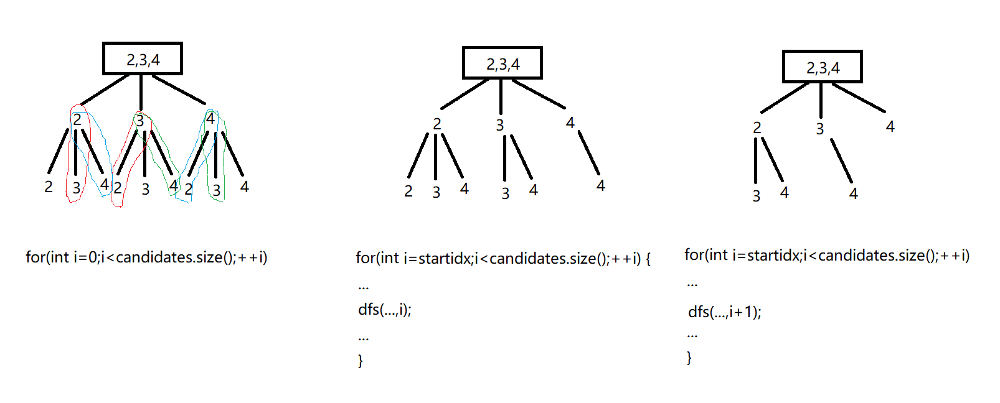

# DFS
 
## 题集列表

* 子集问题
  * 78.子集
  * 90.子集 II

* 组合问题

  * 77.组合
  * 17.电话号码的字母组合
  * 39.组合总和
  * 40.组合总和 II
  * 216.组合总和 III

* 排列问题

  * 46.全排列
  * 47.全排列 II

* 切割问题

  * 131.分割回文串
  * 93.复原 IP 地址

* 棋盘问题

  * 51.N 皇后
  * 37.解数独

* 岛屿问题

  * 200.岛屿数量
  * 1254.统计封闭岛屿的数目
  * 1020.飞地的数量
  * 695.岛屿的最大面积
  * 1905.统计子岛屿
  * 694.不同岛屿的数量

* 其他

  * 491.递增子序列
  * 332.重新安排行程

## 子集问题

子集问题可依据目标数组的元素是否重复而分为两类：

1. 目标数组元素全不相同
2. 目标数组部分元素重复

子集问题的剪枝是对于情况2进行去重操作，有以下三种方式去重（注意首先对candidates数组sort排序）：

1. set集合

```
unordered_set<int> uset;
for (int i = startidx; i < nums.size(); ++i) {
    if (uset.find(nums[i]) != uset.end()) continue;
    uset.insert(nums[i]);
    tmp.push_back(nums[i]);
    dfs(nums, i + 1);
    tmp.pop_back();
}
```

2. used数组

```
for (int i = startidx; i < nums.size(); ++i) {
// used[i - 1] == true，说明同一树枝candidates[i - 1]使用过
// used[i - 1] == false，说明同一树层candidates[i - 1]使用过
// 对同一树层使用过的元素进行跳过
    if (i > 0 && nums[i] == nums[i - 1] && used[i - 1] == false) continue;
    tmp.push_back(nums[i]);
    used[i] = true;
    dfs(nums, i + 1, used);
    used[i] = false;
    tmp.pop_back();
}
```

3. for内部if（不使用used数组）

```
for (int i = startidx; i < nums.size(); ++i) {
// 对同一树层使用过的元素进行跳过
    if (i > startidx && nums[i] == nums[i - 1] ) { 
    // 注意这里使用i > startidx
    	continue;
    }
    tmp.push_back(nums[i]);
    dfs(nums, i + 1);
    tmp.pop_back();
}
```

## 组合问题

和子集问题类似，组合问题的`candidates`数组可划分为有/无重复元素两类，但组合问题还要考虑`k`值（子数组`tmp`的大小）是否给定和`candidates`数组元素是否能重复使用等。

* 对于`candidates`数组元素重复/使用次数：
当`candidates`数组包含重复元素时（`tmp`数组对`candidates`数组素的使用次数最多为1次，否则candidates数组本身元素的重复就没有意义）就必须使用sort+去重，此时去操作与子集问题中的方法一致。而当`tmp`数组能够多次使用`candidates`数组任意元素时，则使用sort+对i剪枝。

* 对于`startidx`与`i`：
组合问题在某一节点进行路径探索时，**起始位置`startidx`（一般为`startidx`，单数组求合需使用`startidx`，多数组求组合不需要使用`startidx`，特例参见17. 电话号码的字母组合）== 递归传`startidx==i+1`（任意元素至多使用一次）或i（任意元素不限次数使用，在循环结束条件对i剪枝）**。具体candidates数组不含重复元素，且tmp数组对candidates数组元素使用次数无限制时，在递归传入的startid应为i，使进入递归后循环从startidx开始，而并非从0开始，原因如下：



任意元素至多使用一次的情况（`startidx==i+1`）就不赘述，同理。

* 对于K：
K值的给定与否直接对剪枝造成影响（for循环终止条件，即i的范围）：`;i<candidates.size()-k+tmp.size()+1;`
但是对i范围操作的剪枝并不能影响结束条件，假如39. 组合总和和40. 组合总和 II增加`k`约束条件，不要忘记对结束条件进行修正。

## 排列问题

同样，排列问题也能够根据candidates数组内元素重复与否分为两类，但是区别于组合问题，有以下特点：

* 每层都是从`0`开始搜索而不是`startidx`
* 需要`used数组`记录tmp数组里已经放了哪些元素

*talk is cheap：*

针对无重复元素candidates数组：

```
for (int i = 0; i < candidates,size(); ++i) {
    if (used[i]) continue;
    tmp.emplace_back(candidates[i]);
    used[i] = true;
    dfs(…);
    used[i] = false;
    tmp.pop_back();
}
```

针对有重复元素数组candidates：

```
sort();
for() {
    if ((i > 0) && (candidates[i] == candidates[i-1]) && (used[i-1] == false)) continue;
    if (!used[i]) {
        tmp.emplace_back(candidates[i]);
        used[i] = true;
        dfs();
        used[i] = false;
        tmp.pop_back();
    }
}
```

## 切割问题

切割问题面对的处理对象一般为字符串。切割问题有两个难点，一是将其抽象成组合问题，二是切割区间的理解（`startidx`和`i`）一旦完成抽象和区间划分，不难写出以下递归回溯代码框架：

```
dfs(…,idx) {
    …//叶子节点：结束条件+结果收集
    for(int i = idx; i < s.size(); ++i){
        if (!isValid(a, startidx, i)) continue; // 切割条件剪枝,判断前序子串[startidx,i]是否满足条件
        … // 前序
        dfs(…, i + 1);
        … // 后序
    }
}
```

题目中给出的切割条件即可转化为剪枝操作（回文、ip等）。对字符串的判断或操作的引入往往弱化了题目难度，具体代码实现在此不进行列举。

## 棋盘问题

### N皇后

对于整个棋盘的搜索是从左向右、从上到下进行的。节点的向下遍历都是从0开始，`N-1`停止，即`i∈[0,N)`。而递归的深度，即`startidx`的范围同样也是`[0,N)`。确认好遍历的宽度和深度之后，dfs的入参也就能够确认，即：`chessbox +N+startidx`。

还记得切割问题是如何剪枝的吗？没错，跟切割问题类似，N皇后问题也是依据节点前序遍历的条件来进行剪枝，与切割问题不同的是：切割问题剪枝的判断仅是针对前序子串本身，而N皇后所进行的剪枝是需要对path进行观察。

不难写出以下核心代码：

```
dfs(){
if (startidx == N) {
    res.emplace_back(chessbox);
    return;
}
for (int i = 0; i < N; ++i) {
    if (!isValid()) continue; // 落子条件剪枝，判断前序位置[startidx,i]能否落子
    chessbox[startidx, i] = ’Q’;
    dfs(…, startidx + 1);
    chessbox[startidx][i] = ’.’;
}
```

剪枝实现：

```
bool isValid(){
    for (){if () return false;} // 行
    for (){if () return false;} // 列
    for (){if () return false;} // 左上角
    for (){if () return false;} // 右上角
    return true;
}
```

### 解数独

N皇后问题的解决，能否写出解数独呢？在此列出N皇后式按行遍历递归和二维递归（行+列）两种方式。

#### 核心代码

1. 按行遍历

```
bool dfs(vector<vector<char>>& board, int i, int j) {
    if (j == 9) {
        return dfs(board, i + 1, 0);
    }
    if (i == 9) {return true;}
    if (board[i][j] != '.') {
        return dfs(board, i, j + 1);
    }
    for (char val = '1'; val <= '9'; ++val) {
        if (!isValid(board, i, j, val)) continue;
        board[i][j] = val;
        if(dfs(board, i, j + 1)) return true;
        board[i][j] = '.';
    }
    return false;
}
```

2. 二维深搜

```
bool dfs() {
    for (int i = 0; i < 9; ++i) { // 遍历行
        for (int j = 0; j <9; ++j) { // 遍历列
            if (board[i][j] != '.') continue;
            for (char val = '1'; val <= '9'; ++val) { // 判断[i, j]能否写val
            	if (isValid(i, j, val, board)) {
                    board[i][j] = val; // 写val
                    if (dfs(board)) return true; // 如果找到合适一组立刻返回
                    board[i][j] = '.'; // 回溯，擦除val
                }
            }
            return false; // 9个数都试完不行，返回false
        }
    }
    return true; // 遍历完没有返回false，说明找到了合适棋盘位置
}
```

#### 剪枝

* 朴素剪枝

```
bool isValid(){
    for (int i = 0; i < 9; i) {if (board[row][i] == val) return false;} // 行
    for (int j = 0; j < 9; j) {if (board[j][col] == val) return false;} // 列
    for (int sr=row/3*3;sr< row/3*3+3;++sr) { // 3x3块
    	for (int sc = col / 3 * 3; sc < col / 3 * 3 + 3; ++sc) {
    		if(board[sr][sc] == val) return false;
    	}
    }
    return true;
}
```

* 优化剪枝：

```
bool isValid(){
    for (int i = 0; i < 9; ++i) {
        if (board[row][i] == val) return false;
        if(board[i][col] == val) return false;
        if(board[row][i] == val) return false;
        if(board[row/3*3+i/3][col/3*3+i%3] == val) return false;
    }
    return true;
}
```

## 岛屿问题

岛屿问题主要是解决1)数量和2)面积两种问题，而面对岛屿问题最重要的一个思想是“淹没思想”。淹没的出现，能够消灭used数组的维护。

### 岛屿数量

入门岛屿问题，写出本题框架

```
int solve() {
    for () { // 行
        for() { // 列
            if (grid[i][j] == 0) continue;
            ++res;
            dfs(grid, i, j);
        }
    }
}
int dfs(grid, row, col) { // 淹没上下左右的陆地
    if (…) return; // 越界
    if (grid[row][col] == 0) return;
    grid[row][col] = 0;
    dfs();
    dfs();
    dfs();
    dfs();
}
```

### 统计封闭岛屿的数目

相比于上一题，不难发现原本临边界的岛屿不进行计算，所以直接在上一题的基础上，首先淹没掉临边界的岛屿。如果你理解了上一题的代码，会发现淹没的递归是将一小片岛屿全部淹没，所以我们需要用到相同的递归来“解决”掉临边界岛屿，一石二鸟。

```
int solve() {
    for () { // 上下
        dfs(, 0, i);
        dfs(, grid.size() - 1, i);
    }
    for() { // 左右
        dfs(, j, 0);
        dfs(, j, grid[0].size());
    }
    …
}
```

### 飞地的数量

理解好题意后，会发现此题就是求所有封闭岛屿的面积。要求封闭岛屿，首先应该想到“去边”，然后思考面积的计算该如何实现呢？是的，去完边后，剩下的陆地数量总和不就是飞地了么？没错，就是遍历“去边”操作之后的二维数组中的陆地总数。具体代码不在此列举。

### 岛屿的最大面积

求取了封闭岛屿面积和之后，如何求取岛屿最大面积呢？如果你还记得上文中说到的“将一小片岛屿全部淹没”，那么单片岛屿陆地数量的计算就不成问题。

```
dfs() {
    for() {
        for() {
            if (grid[i][j] == 0) continue;
            singleislandcover=dfs(grid, i, j);
            res=max(res, singleislandcover);
        }
    }
}
int dfs() {
    if (…) return 0;
    grid[r][c] = 0;
    return dfs() + dfs() + dfs() + dfs() + 1;
}
```

## 其他

待续…
