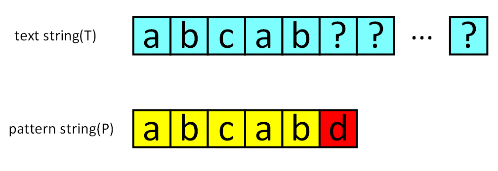

# 字符串匹配算法

## 字符串匹配问题是什么

*算法都是来解决问题的！看到一类算法首先要知道它是用来解决什么问题，如果不清楚这一点，那这个算法对于你可能没有实际价值。*
* Q：what is the Exact String Matching problem?
* A：给出一个P（pattern string）和一个T（text string），在T中找出所有匹配的P。
* E.G.：假设P == "aba"，T == "bbabaxababay"，则P在T中出现的位置（index）分别是2、6和8。其中6和8有重叠。

## KMP简介

[维基百科](https://en.wikipedia.org/wiki/Knuth%E2%80%93Morris%E2%80%93Pratt_algorithm)

知道你也不会看...还是直接进入正题吧...

## 纯暴力算法

在介绍KMP、BM、RK等算法之前，首先从简单的、原始的暴力算法（Brute-Force）讲起。
### 实现代码

既然已经知道字符串匹配问题是什么，那其实质朴的暴力算法应该就呼之欲出了。

* 枚举i = 0,1,2,3,...,len(T) - len(P)。
* 比较T[i : i + len(P)]与P是否相等，如果一致，则找到一个匹配。

该算法思路清楚，逻辑简单。
```
//CPP
void bfStringMatch(string p, string t)
{
    int plen = p.size();
    int tlen = t.size();
    if (plen > tlen) {
        return;
    }
    for (int i = 0; i <= tlen - plen; ++i) {
        bool flag = true;
        for (int j = 0; j < plen; ++j) {
            if (p[j] ! = t[i+j]) {
                flag = false;
                break;
            }
        }
        if (flag) {
            cout<<i<<" ";
        }
    }
}
```

### 暴力求解复杂度

1. 单次进行“字符串比较”小任务：最坏可能出现以下情况——两个字符串唯一的差别在最后一个字符，在此种情况下，模式串必须走过完整的匹配串，才能得出结果，复杂度为O(len)。
2. 暴力算法可能遭遇的最坏情况：记`n = plen`,`m = tlen`。每次小任务付出`n`次字符比较代价，总共需要比较`m - n + 1`次，因此时间复杂度为O(n*(m-n+1))。考虑到主串一般比模式串长很多，所以暴力算法的复杂度为O(nm)。

## 对暴力算法的改进

虽然代码逻辑简单，但不难发现暴力算法慢得像爬一样。它最坏的情况如下图所示：


我们很难降低“小任务”的复杂度（因为比较两个等长字符串，真的只能逐个比较字符）。因此，我们考虑到降低“小任务”的次数。如果比较的次数能降到足够低，那么总的复杂度也将会下降很多。

要优化一个算法，首先要回答的问题是 **“我手上有什么信息？”** 我们手上的信息是否足够、是否有效，决定了我们能把算法优化到何种程度。**请记住：尽可能利用残余的信息，是KMP算法的思想所在。**

在暴力算法中，如果从 T[i] 开始的那一趟比较失败了，算法会直接开始尝试从 T[i+1] 开始比较。这种行为，属于典型的 **“没有从之前的错误中学到东西”** 。我们应当注意到，一次失败的匹配，会给我们提供宝贵的信息——如果 T[i : i+len(P)] 匹配是在第 r 个位置失败的，那么从 T[i] 开始的 (r-1) 个连续字符，一定与 P 的前 (r-1) 个字符一模一样！


需要实现的任务是“字符串匹配”，而每一次失败都会给我们换来一些信息——能告诉我们，主串的某一个子串等于模式串的某一个前缀。但是这又有什么用呢？

### 跳过不可能成功的字符串比较

有些趟字符串比较是有可能会成功的,有些则毫无可能。我们刚刚提到过，优化 Brute-Force 的目标是“尽量减少比较的趟数”，而如果我们跳过那些绝不可能成功的字符串比较，则可以希望复杂度降低到能接受的范围。

那么，哪些字符串比较是不可能成功的？来看一个例子。已知信息如下：

* 模式串 P = "abcabd".
* 和主串从T[0]开始匹配时，在 P[5] 处失配。



首先，利用上一节的结论。既然是在 P[5] 失配的，那么说明 T[0:5] 等于 P[0:5]，即"abcab". 现在我们来考虑：从 T[1]、T[2]、T[3] 开始的匹配尝试，有没有可能成功？

从 T[1] 开始肯定没办法成功，因为 T[1] = P[1] = 'b'，和 P[0] 并不相等。从 T[2] 开始也是没戏的，因为 T[2] = P[2] = 'c'，并不等于P[0]. 但是从 T[3] 开始是有可能成功的——至少按照已知的信息，我们推不出矛盾。


带着 **“跳过不可能成功的尝试”** 的思想，我们引入了next数组。

## next数组

next数组是对于模式串而言的。P 的 next 数组定义为：next[i] 表示 P[0] ~ P[i] 这一个子串，使得 **前k个字符** 恰等于 **后k个字符** 的最大的k. 特别地，k不能取i+1（因为这个子串一共才 i+1 个字符，自己肯定与自己相等，就没有意义了）。


上图给出了一个例子。P="abcabd"时，next[4]=2，这是因为P[0] ~ P[4] 这个子串是"abcab"，前两个字符与后两个字符相等，因此next[4]取2. 而next[5]=0，是因为"abcabd"找不到前缀与后缀相同，因此只能取0.

如果把模式串视为一把标尺，在主串上移动，那么 Brute-Force 就是每次失配之后只右移一位；改进算法则是每次失配之后，移很多位，跳过那些不可能匹配成功的位置。但是该如何确定要移多少位呢？


在 S[0] 尝试匹配，失配于 S[3] <=> P[3] 之后，我们直接把模式串往右移了两位，让 S[3] 对准 P[1]. 接着继续匹配，失配于 S[8] <=> P[6], 接下来我们把 P 往右平移了三位，把 S[8] 对准 P[3]. 此后继续匹配直到成功。

我们应该如何移动这把标尺？很明显，如图中箭头所示，旧的后缀要与新的前缀一致（如果不一致，那就肯定没法匹配上了）！

回忆next数组的性质：P[0] 到 P[i] 这一段子串中，前next[i]个字符与后next[i]个字符一模一样。既然如此，如果失配在 P[r], 那么P[0]~P[r-1]这一段里面，前next[r-1]个字符恰好和后next[r-1]个字符相等——也就是说，我们可以拿长度为 next[r-1] 的那一段前缀，来顶替当前后缀的位置，让匹配继续下去！

可以验证一下上面的匹配例子：P[3]失配后，把P[next[3-1]]也就是P[1]对准了主串刚刚失配的那一位；P[6]失配后，把P[next[6-1]]也就是P[3]对准了主串刚刚失配的那一位。


### next数组的建立与使用

了解了利用next数组加速字符串匹配的原理，我们接下来代码实现之。分为两个部分：
1. 建立next数组
2. 利用next数组进行匹配。

首先是建立next数组。我们暂且用最朴素的做法，以后再回来优化：

```
//CPP
vector<int>next;
void GetKMPNextArr(const string& p) {
    next.resize(p.size(),0);
    for (int pr = p.size() - 1; pr > 0; --pr) {
        for (int pl = pr; pl > 0; --pl) {
            int i = 0;
            for (int pos = pl; pos <= pr; ++pos, ++i) {
                if (p[i] != p[pos]) {
                    break;
                }
            }
            if (i == pr - pl + 1) {
                next[pr] = max(next[pr],i);
            }
        }
    }
}
```

使用python能够更加简洁：

```
#python
def getNext(x):
    for i in range(x, 0, -1):
        if p[0:i] == p[x-i+1:x+1]:
            return i
    return 0

next = [getNext(x) for x in range(len(p))]
```

如上图代码所示，直接根据next数组的定义来建立next数组。不难发现它的复杂度是O(n^2^)的。

接下来，实现利用next数组加速字符串匹配。代码如下：

```
vector<int> GetMasterStringStartIdx(const string& t, const string& p) {
    GetKMPNextArr(p);
    int tidx = 0, pidx = 0;
    vector<int>ret;
    while (tidx < t.size()) {
        if (t[tidx] == p[pidx]) {
            ++tidx;
            ++pidx;
        } else if (pidx != 0) {
            pidx = next[pidx - 1];
        } else {
            ++tidx;
        }
        if (pidx == p.size()) {
            ret.emplace_back(tidx - pidx);
            pidx = next[pidx - 1];
        }
    }
    return ret;
}
```

如何分析这个字符串匹配的复杂度呢？乍一看，pidx值可能不停地变成next[pidx-1]，代价会很高；但我们使用摊还分析，显然pidx值一共顶多自增len(S)次，因此pidx值减少的次数不会高于len(T)次。由此，复杂度是可以接受的，不难分析出整个匹配算法的时间复杂度：O(m+n)。

### 快速求解next数组

终于来到了我们最后一个问题——如何快速构建next数组。

首先说一句：快速构建next数组，是KMP算法的精髓所在，核心思想是 **“P自己与自己做匹配”** 。

为什么这样说呢？回顾next数组的完整定义：

* 定义 “k-前缀” 为一个字符串的前 k 个字符； “k-后缀” 为一个字符串的后 k 个字符。k 必须小于字符串长度。

* next[x] 定义为： P[0]~P[x] 这一段字符串，使得 **k-前缀恰等于k-后缀** 的最大的k.

这个定义中，不知不觉地就包含了一个匹配——前缀和后缀相等。接下来，我们考虑采用递推的方式求出next数组。如果next[0], next[1], ... next[x-1]均已知，那么如何求出 next[x] 呢？

来分情况讨论。首先，已经知道了 next[x-1]（以下记为now），如果 P[x] 与 P[now] 一样，那最长相等前后缀的长度就可以扩展一位，很明显 next[x] = now + 1. 图示如下。


刚刚解决了 P[x] = P[now] 的情况。那如果 P[x] 与 P[now] 不一样，又该怎么办？


如图。长度为 now 的子串 A 和子串 B 是 P[0]~P[x-1] 中最长的公共前后缀。可惜 A 右边的字符和 B 右边的那个字符不相等，next[x]不能改成 now+1 了。因此，我们应该 **缩短这个now** ，把它改成小一点的值，再来试试 P[x] 是否等于 P[now].

now该缩小到多少呢？显然，我们不想让now缩小太多。因此我们决定，在保持“P[0]~P[x-1]的now-前缀仍然等于now-后缀”的前提下，让这个新的now尽可能大一点。 P[0]~P[x-1] 的公共前后缀，前缀一定落在串A里面、后缀一定落在串B里面。换句话讲：接下来now应该改成：使得 **A的k-前缀** 等于 **B的k-后缀** 的最大的k.

你应该已经注意到了一个非常强的性质—— **串A和串B是相同的！** B的后缀等于A的后缀！因此，使得A的k-前缀等于B的k-后缀的最大的k，其实就是串A的最长公共前后缀的长度 —— next[now-1]！


来看上面的例子。当P[now]与P[x]不相等的时候，我们需要缩小now——把now变成next[now-1]，直到P[now]=P[x]为止。P[now]=P[x]时，就可以直接向右扩展了。

CPP代码实现如下：

```
void GetKMPNextArr(const string& p) {
    next.resize(p.size(), 0);
    int left = 0, right = 1;
    while (right < p.size()) {
        if (p[right] == p[left]) {
            ++left;
            next[right] = left;
            ++right;
        } else if (left != 0) {
            left = next[left -1];
        } else {
            next[right] = 0;
            ++right;
        }
    }
}
```

不难证明构建next数组的时间复杂度是O(m)的。至此，我们以O(m+n)的时间复杂度，实现了构建next数组、利用next数组进行字符串匹配。
